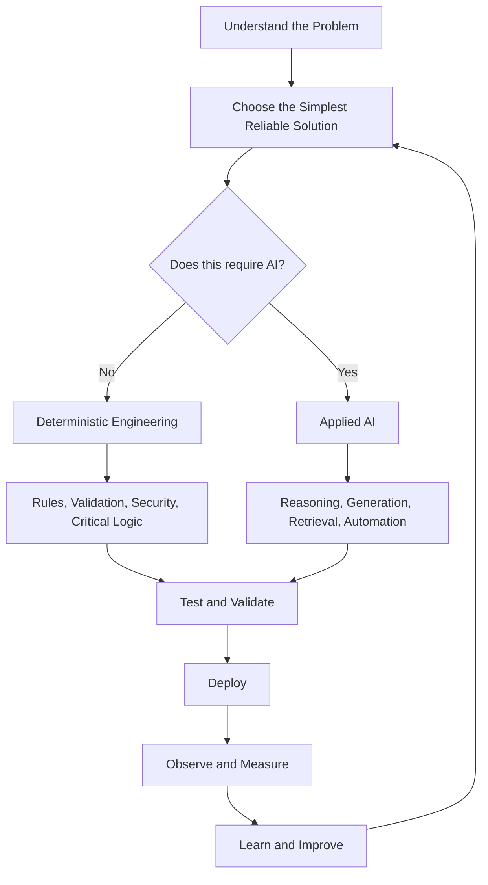

# Hi, I'm Muhammad Hassan 👋

### Principal Software Engineer · Forward Deployed Engineering · Backend · Applied AI · Cloud

I build **scalable backend systems, AI-powered products, real-time
platforms, and cloud infrastructure** --- from architecture and APIs to
deployment, observability, and production optimization.

My engineering philosophy is simple:

> **Use AI where it creates leverage. Use deterministic software where
> correctness matters.**

I don't add LLMs, agents, RAG, or vector databases simply because
they're available. I use them when they genuinely improve the product
--- while keeping business rules, constraints, validation, security, and
critical workflows deterministic and testable.

------------------------------------------------------------------------

## 👨‍💻 What I Work On

-   🏗️ Backend & distributed system architecture
-   🤖 Production AI / LLM applications
-   🎯 Forward Deployed Engineering
-   ⚡ Real-time & event-driven systems
-   🧠 Recommendation & personalization systems
-   🔌 APIs, SDKs & third-party integrations
-   ☁️ Cloud-native infrastructure & DevOps
-   🔄 Workflow automation & AI agents
-   📊 Data pipelines, ETL & web scraping
-   🔍 Observability, reliability & production debugging

------------------------------------------------------------------------

## 🛠️ Engineering Stack

### Backend

**Python**\
Django · Django REST Framework · FastAPI · Flask · Celery

**Node.js / TypeScript**\
Node.js · Express · NestJS · Fastify · Socket.IO

**Go**\
Golang · Gin · gRPC · WebSockets · Concurrent Services

**PHP / .NET**\
Laravel · Symfony · WordPress · C# · .NET / ASP.NET Core

### Frontend & Mobile

React · Next.js · Angular · Vue.js · JavaScript\
Flutter · BLoC · MERN Stack · Chrome Extensions

### APIs & Architecture

REST · GraphQL · gRPC · WebSockets · Webhooks · SDKs\
Microservices · Event-Driven Architecture · Distributed Systems

------------------------------------------------------------------------

## 🤖 Applied AI & LLM Engineering

OpenAI · Claude · Gemini · Hugging Face

RAG · LangChain · Prompt Engineering · Context Engineering\
AI Agents · AI Chatbots · Tool / Function Calling\
Structured Outputs · Semantic Search · Embeddings\
Recommendation Systems · Personalization · Fine-Tuning

### Retrieval & Vector Systems

pgvector · Pinecone · ChromaDB

### Production AI

-   LLM evaluation & regression testing
-   Structured output / schema validation
-   Guardrails & constraint enforcement
-   Hallucination and failure handling
-   Model/API fallback strategies
-   Prompt & model versioning
-   AI observability & tracing
-   Latency and token-cost optimization
-   Human-in-the-loop workflows

------------------------------------------------------------------------

## ☁️ Cloud & DevOps

**AWS**\
EC2 · EKS · Lambda · RDS · S3 · VPC

**Google Cloud**\
GKE · Cloud Run · BigQuery · Cloud SQL

**Azure**\
AKS · IoT Hub · Stream Analytics

**Infrastructure & Delivery**\
Docker · Kubernetes · Linux · Nginx\
GitHub Actions · GitLab CI/CD · Jenkins · Bitbucket Pipelines

------------------------------------------------------------------------

## 🗄️ Data & Storage

PostgreSQL · PostGIS · Apache AGE · pgvector\
MySQL · MariaDB · MS SQL · SQLite\
MongoDB · CockroachDB · Redis

Kafka · ETL · Data Pipelines · Web Scraping · Data Processing

------------------------------------------------------------------------

## ⚡ Real-Time & Distributed Systems

Kafka · Redis · WebSockets · Socket.IO · SignalR · gRPC

I build systems around:

-   Event-driven architecture
-   Microservices
-   Message-driven processing
-   Background workers
-   Real-time synchronization
-   High-concurrency services
-   Distributed workflows

------------------------------------------------------------------------

## 📊 Observability & Reliability

Prometheus · Grafana · Loki · Sentry · UptimeRobot

Logging · Metrics · Tracing · Alerting · Production Monitoring

> If a production system can't tell you why it's failing, it isn't
> finished.

------------------------------------------------------------------------

## 🎯 Forward Deployed Engineering

I enjoy working where **engineering meets real business problems**.

My workflow:

**Discover → Scope → Architect → Build → Integrate → Deploy → Measure →
Improve**

That means being comfortable with more than implementation:

-   Translating ambiguous requirements into technical systems
-   Rapid prototyping and MVP development
-   Solution architecture
-   Customer-specific integrations
-   AI/LLM workflow implementation
-   Backend and full-stack delivery
-   Data integration and migration
-   Production deployment
-   Debugging real-world failures
-   Measuring reliability and adoption
-   Turning one-off solutions into reusable capabilities

The objective isn't simply to ship code.

**It's to solve the problem and leave behind a system that can keep
evolving.**

------------------------------------------------------------------------

## 🧪 How I Engineer

I treat testing, security, observability, and maintainability as part of
development --- not cleanup work after development.

My typical workflow includes:

`Unit Tests` · `Integration Tests` · `API Tests` · `Feature Tests`\
`Regression Tests` · `CI/CD Quality Gates` · `Code Review`\
`Monitoring` · `Logging` · `Production Feedback`

For AI systems:

`LLM Evals` · `Schema Validation` · `Constraint Testing`\
`Failure Cases` · `Fallbacks` · `Regression Evals`

When a production bug appears, I prefer turning it into a regression
test so the same class of failure doesn't quietly return.

------------------------------------------------------------------------

## 🧭 Engineering Principles

### Core Principles

- **Solve the problem before choosing the technology**
- **Simple and reliable beats unnecessarily complex**
- **Deterministic logic > AI when correctness matters**
- **AI should earn its place in the architecture**
- **Test behavior, not implementation details**
- **Security is a requirement, not an afterthought**
- **Observability is part of the system**
- **Prototype quickly. Productionize carefully.**
- **Optimize from evidence, not assumptions**
- **Own the outcome, not just the ticket**

------------------------------------------------------------------------

## 🎓 Certifications

-   AWS Certified Cloud Practitioner --- CLF-C02
-   Agile Scrum Master
-   System Architect
-   DevOps Practices
-   Jira & Confluence Bootcamp
-   Graphic Design Theory

------------------------------------------------------------------------

## 🚀 Current Focus

-   Forward Deployed Engineering
-   Production AI systems
-   Agentic workflows
-   Model Context Protocol (MCP)
-   RAG & retrieval systems
-   LLM evaluation
-   AI observability
-   Recommendation & personalization
-   Distributed systems
-   Cloud-native architecture

------------------------------------------------------------------------

## 🤝 Let's Connect

I'm interested in difficult engineering problems involving **backend
systems, distributed architecture, cloud infrastructure, data,
automation, and applied AI**.

If you're building something where those areas intersect, feel free to
reach out.

**Build fast. Validate early. Measure everything. Use AI where it earns
its place.**
